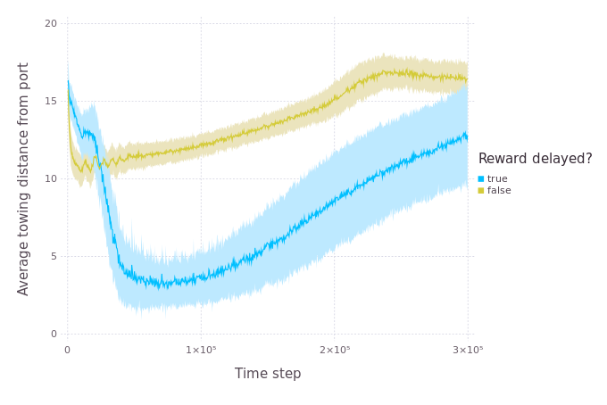

# TDFishers

This is a toy model that I (mostly) wrote over the course of a weekend. It simulates a fishery: fishing boats go at sea, catch some fish, come back to port, sell the fish, and go out again. The twist is that fishers have to *learn* how to do all this.

In order to do that, they use a temporal-difference (TD) reinforcement learning algorithm called [SARSA](https://en.wikipedia.org/wiki/State%E2%80%93action%E2%80%93reward%E2%80%93state%E2%80%93action) (for State-Action-Reward-State-Action). Fishers know only two things about their state: where they are, and whether or not their hold is full. At each time step, they take one of nine possible actions: stay where they are, or move to one of the eight adjacent grid cells (if possible). Staying where they are means trawling for fish if they are at sea or emptying their hold if they are at port. They get a negative reward for the fuel burned while at sea and they get a positive reward for fish caught when they empty their hold. That's all.

The model is heavily inspired by the [POSEIDON](https://github.com/CarrKnight/POSEIDON) model, but it is drastically simplified.

### How to run

To launch from a \*nix shell, you can use the provided sbt launcher script: `./sbt run` (sbt will be downnloaded if needed). From Windows, you'll have to [get sbt 0.13.17](https://www.scala-sbt.org/download.html) yourself, make sure it's on your path, and call `sbt run`. Choose `np.tdfishers.gui.TDFishersGUI` at the little menu to get the version with a GUI.

### About the visualisation

- The ocean is represented as a coloured grid, where the colour indicates the biomass: red when a cell is full of fish, white when it is empty.

- The fishers are displayed as half-transparent black circles, so they show up darker when lots of them are in the same spot. The size of the circle indicates whether a fisher is moving or not: small circles when they are on the go, bigger circles when they are trawling or at port.

  

### A few of the simplifications vs. POSEIDON

- Fishers have no limit to how long they can stay at sea: they have infinite gas and stamina. The only reason for them to go back to port is when their hold is full.

- Fishers don't need to fish in the same spot for their whole time at sea; they can move around as much as they please.

- Fishers don't need to stay at port for any significant length of time: they can empty their hold in a single time step and go right back out.

- Fishers have no friends. Or at least, they don't exchange any information.

- We make the ocean smallish (25 by 25 cells) to keep the size of the state space manageable for the RL algorithm. It still works on a bigger ocean, but fishers take much longer to learn and the memory demands are considerable. For this approach to work on a larger scale, state space reduction techniques would need to be applied.

- The ocean is a bounded rectangle. When agents try to go over the edge, they "bump" against it but still pay the price for gas.

- There isn't any land. There is a single port cell in the middle of the left edge, but that's it.

- All cells start at their full carrying capacity.

- The prices of fish and gas are stable.

- Not really a simplification, but our time steps represent one hour instead of a day.

### A few things of note regarding the model's behaviour

- Fishers take a long time to learn. Yet, it is still impressive that they do, given that they need to learn how to move around (no A\* pathfinding for them) and figure out what to do when their hold is full (there is nothing telling them "go back to port"; they just won't get a reward until they do).

- This learning process make the initial dynamics very different from the POSEIDON model. Fishers explore way more at the beginning, and it takes them a while to start fishing systematically closer to the port. When they do, however, we see the expected dynamics of nearby resource depletion followed by a progressive increase in the distance from port. This takes many simulation years to achieve, though.

  

- I initially chose to give agents immediate rewards for fish caught instead of waiting for when they go back to port. My intuition was that it would make learning easier, but intuitions cannot always be trusted. It appears that delaying the reward instead encourages fishers to take shorter trips, leading to what I suppose might be more realistic behaviour. The above plot shows both conditions.

- I suppose that if I added a limited gas capacity to fishing boats and a huge cost to getting re-fuelled at sea when running out, my fishers would quickly learn not to stay too far away from port. (I suspect this would make a major difference.)

- The fishing "front" (when fishers exploit the edge of the depleted zone) is never as clear as it should be. I'm not sure what it would take to get that pattern right at the moment.

- Once the system settles in a more stable behaviour, you can sometimes see fishers get "lost at sea". What happens is that when they wander outside of the well-explored zone around the port, they have no policy telling them how to get back, so they basically undertake a random walk until they come back to a spot from which they know their way.

- You will sometimes see the corners of the ocean getting depleted near the beginning of a simulation. This happens because fishers sometimes get stuck in the corners while they learn not to bump against the edges.

### About the code

The main class of the model is `TDFishers`, but the two key classes to understand what's going on are `Fisher`, which implements the fishermen agents, and `Learning`, which implements the TD learning algorithm that they use.

One of my objectives in this project was to get reacquainted with the [MASON](https://cs.gmu.edu/~eclab/projects/mason/) ABM toolkit and the Java language, since I have mostly focussed on [NetLogo](http://ccl.northwestern.edu/netlogo/) and [Scala](http://scala-lang.org/) in the recent past. MASON is the same as ever, but I found Java to be much more pleasant than it used to be, with the addition of lambdas and the Stream API. (I may even have abused streams here and there in the code...) There are still some features of Scala that I missed, though, and I couldn't resist sneaking a [`case class`](https://docs.scala-lang.org/tour/case-classes.html) in there and writing the `FishingDistanceExperiment` in Scala.

I also included [ScalaTest](http://www.scalatest.org/) in the build, but there are very few unit tests. Time was short.
